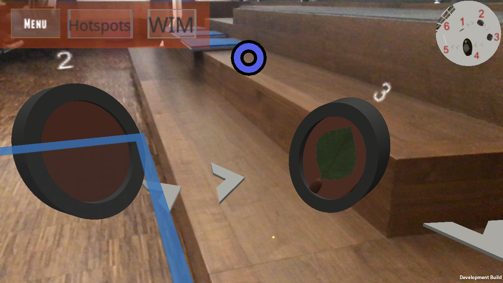
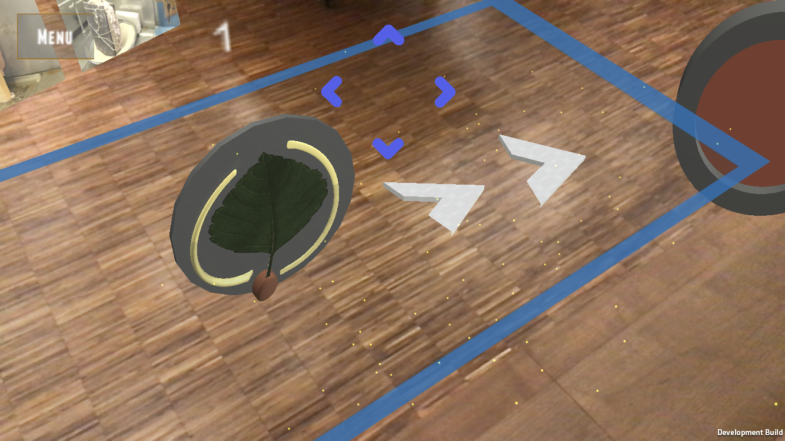
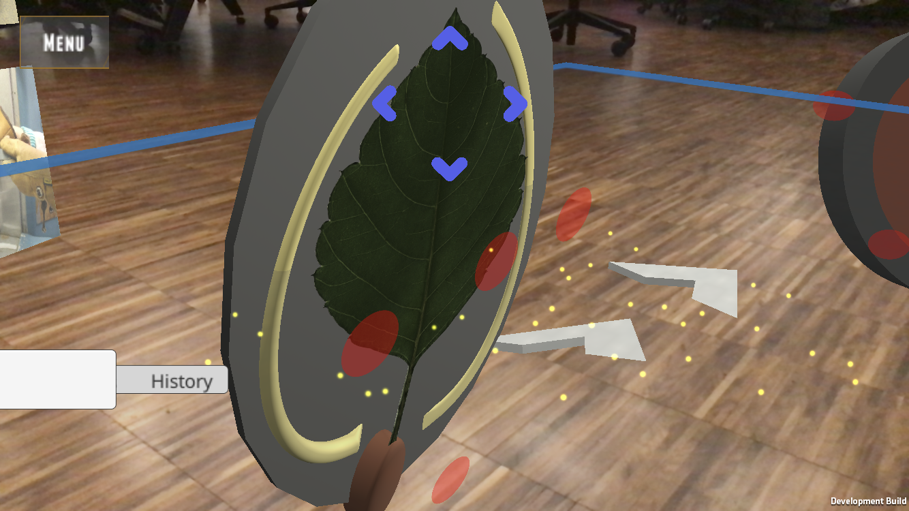
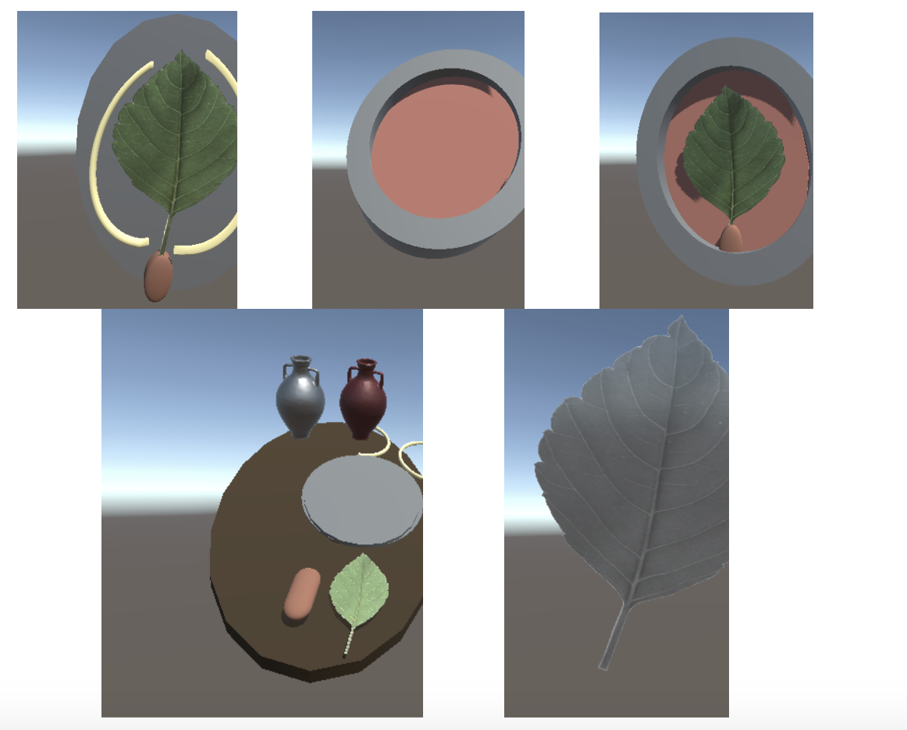
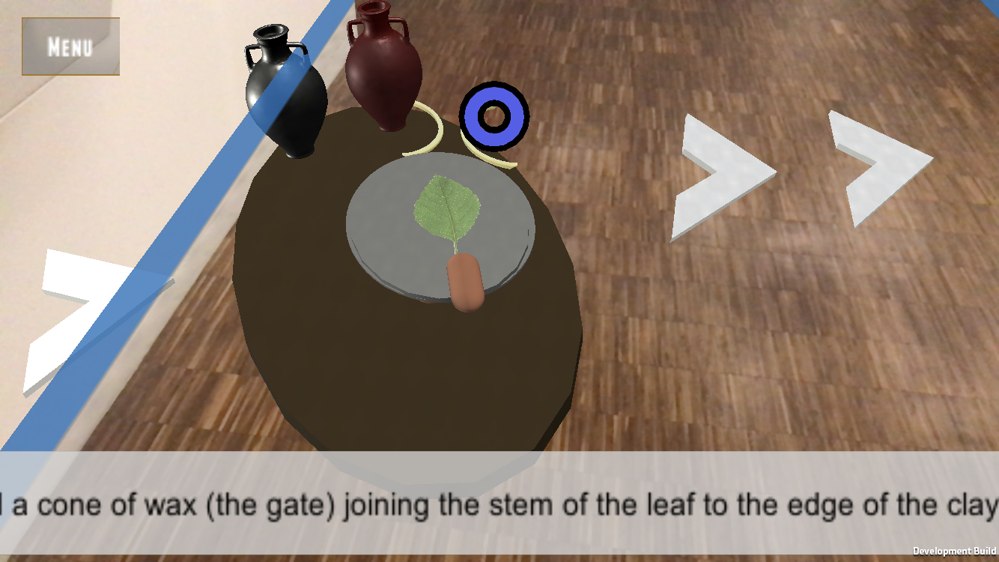
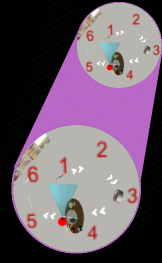
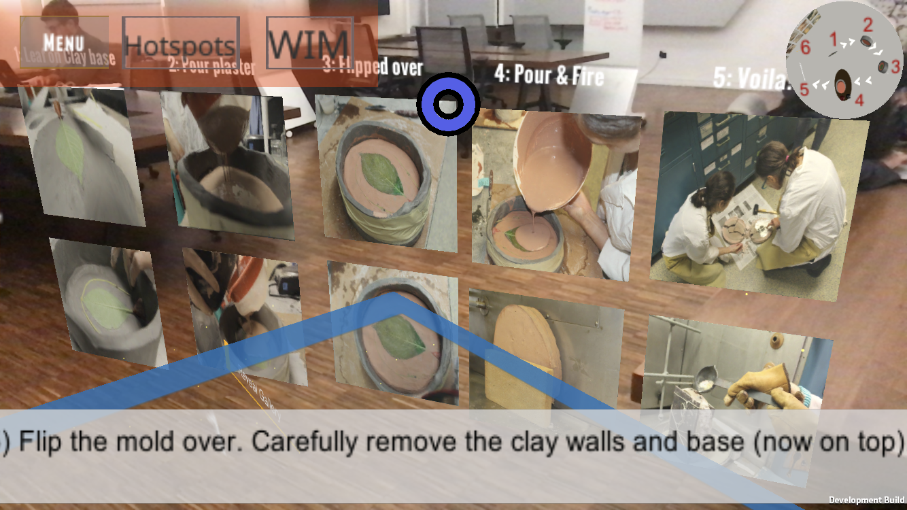

# Making-And-Knowing-Project
Making and Knowing AR Project
Authors: Sara Samuel, Vivien Ngo, Shreya Vaidyanathan, Edith Comas

I. Introduction

“How is it Made?” is our Augmented Reality application that lets users visualize and learn life casting/mould-making done at the Columbia University Making and Knowing laboratory. Our primary goal for this project is to take the user through the process and history of lifecasting of a leaf in an interactive and engaging manner.
II. Instructions and Interactions

Initially, the user must hold their phone above a flat surface, so that the application can detect a ground plane. A well-lit space works best, and the ARKit will soon show yellow particle effects detecting features as the application looks for a ground plane. When the ground plane is detected, a blue box will appear around its area. The user must then tap within the blue box. This sets up the entire scene and the user will initially see that the green leaf model appear at the point of touch in the center of the mobile device’s screen.

From here, the user can move the mobile device around the space to view other models in the scene too.

If the user taps on the screen prior to detecting a ground plane, the models will show up in the incorrect positions (this is a constraint imposed by ARKit).  If the user happens to tap on the screen prior to detecting a ground plane, he/she must close the app and re-open it.

A. Selection and Manipulation

A blue cursor that appears at the center of the screen allows 3D interactions on all models. The cursor follows the position of the camera, so user can move the mobile device to focus this cursor on top of any of the models in the scene.  When nothing is selected, the cursor appears as a circle. When a model is selected, the cursor becomes a rectangle (See Figure 1).  When a model has been selected by the cursor, it can be manipulated, either by scaling or rotation.

  

Figure 1: Circular cursor prior to model selection (Left). Square cursor upon model selection (Right).

To scale, the user can perform a two finger pinch zoom-in/zoom-out gesture on the screen. This allows the user to view each part of the scaled model in three-dimensional space with in great detail. To rotate any model, the user can touch and drag one finger across the screen from right-to-left or left-to-right and the desired model will be rotated accordingly.

Initially when the models appear, they do not have any informational hotspots on them. A “Menu” button on the top-left corner of the screen brings up additional functionalities available in our application. On touching the “Menu” button, a panel showing two buttons “Hotspots” and “WIM” will appear alongside it. The “Hotspots” button shows and hides the hotspots on all of the models, and also makes the “Process/Historical” mode toggle visible.

The “WIM” (World-in-miniature) button opens and closes the WIM on the top right corner of the screen (See Figure 2).  

  
Figure 2: Top left- the Menu that allows the user to show/hide the Hotspots and WIM.  Top Right- the WIM

When the user taps on a hotspot (using the touchscreen), red “hotspots” will appear on each model and informational text box will pop-up when the user taps any of the hotspots on the model. This will make Text Boxes containing a lot of information appear on the screen space where the user can read them comfortably along with the scrolling functionality.

Touching the “Hotspots” button will also bring up a Toggle on the bottom left side of the screen and this allows the user to select either “Process” or “Historical” mode and see textboxes with specific information on each models (See Figure 3). The text that appears will change depending upon which mode has been selected on the toggle. The “Historical mode” shows text from the original French manuscript that the Making and Knowing lab uses and the “Process mode” shows the text pertaining the steps of the process (given by the lab to us). The user can switch between the two modes at any time.

 
Figure 3: History/Process mode toggle on the bottom left corner of the screen. In the image on the right, there is a historical mode textbox open, corresponding to a selected hotspot.  Top of right image: the “Menu” that allows you to show/hide hotspots and WIM.

B. Wayfinding and Travel

Our application makes use of  5 main waypoints (See Figure 4). The first three waypoints corresponds to a specific model used in the lifecasting process in incremental order. These waypoints are that of the model of an initial green leaf in the clay base with wax strips, a model showing the process after plaster was poured onto it, and a model showing the other side of the leaf when the base is flipped state.

 
 
Figure 4: Five waypoints: Leaf in clay base, mold with plaster poured, Leaf in mold, animation of process, and final metal molded leaf

This is followed by the animation that takes the user through the full lifecasting process and then the final molded metal leaf. There are white arrows in worldspace places between each successive waypoint, so that the user can easily find the next waypoint. At any given view of the application, users will be able to see the progression between the waypoints so that they can effortlessly go through the entire process of life casting that we are showcasing.

All of these waypoints can be manipulated and interacted with in the manner described above. The user can play the animation (fourth waypoint) by touching the “Play Animation” button on the screen.  A white panel with black captions will appear at the bottom of the screen to accompany the animation (See Figure 5).

 
Figure 5: The animation after it has been played. The white panel with text at the bottom is the caption that accompanies the animation.

The World in Miniature (WIM) that appears in the top right corner of the screen provides additional help with navigation.  In the WIM, the user’s position in the space is indicated by a red dot that follows the camera.  A blue cone protrudes from the red dot to indicate the user’s line of view.  For instance, if the user is looking at model 1, the blue cone will point towards the first model  (labeled with a red numeral “1” in the WIM).  If the user taps on the WIM, a larger WIM will appear below it for easier viewing.  To close the larger WIM, simply tap on the original WIM again (See Figure 6).

 
Figure 6: The World-In-Miniature

Additionally, there is a bonus “Reveal Gallery” button that we have incorporated right after the final metal leaf waypoint. On touching this button, an image gallery with images from the Making and Knowing lab will be shown in the three-dimensional space. Users can move around and see the images that correspond the the entire process that we have shown (See Figure 7).

Figure 7: Image Gallery
